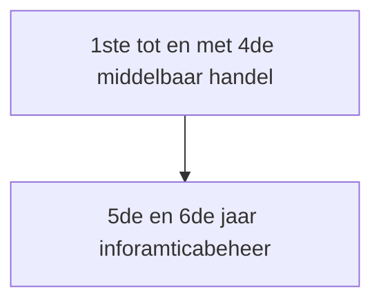

# **Campus college Waregem Informaticabeheer**
## Waarom onze school? 
Het heilighart college of sinds  kort Campus College Waregem beschikt over heel veel materiaal waarmee de leerlingen vrij kunnen meewerken. Leerlingen die bij in onze school informaticabeheer studeerde en hierna een informatica richting volgen hebben enorme slaagkansen in het hoger onderwijs. Onze school wordt zeer hoog aangeschreven binnen het hoger onderwijs.

## Verloop school carrière
### Modeltraject:

### Andere mogelijkheden 
Er zijn ook elk jaar een aantal leerlingen die met Kerstmis in het 5de middelbaar veranderen van richting  WWI naar informaticabeheer. De richting WWI is een informaticarichting in het ASO. Deze richting bestaat uit meer wiskunde, fysica, chemie. Het programmeren in deze richting draait ook vooral rond wiskundige bewerkingen.
## Vakken:

### Algemene vakken
Vak | 5de | 6de|
|--|--|--|
Aardrijkskunde| 1 | 1|
Geschiedenis |1 |1
Godsdienst |2|2
Lichamelijke opvoeding |2|2

### Taalvakken
Vak | 5de | 6de|
|--|--|--|
Engels| 3 | 3|
Frans |3 |3
Nederlands |2|2

### Wiskunde & wetenschappen
Vak | 5de | 6de|
|--|--|--|
Wiskunde| 4 | 4|
Natuurwetenschappen |1 |1

### Specifieke vakken
Vak | 5de | 6de|
|--|--|--|
Toegepaste Informatica Beheer| 4 | 4|
Toegepaste Informatica Software  | 6 |4
Toegepaste Informatica Softwarepakketten |1|0 
Bedrijfseconomie |2|2
Geïntegreerde proef werkuren |0|2

## GIP

De GIP ofwel geïntegreerde proef is een proef die op het einde van elk 6de middelbaar in een technische richting wordt afgenomen. De proef is afgesteld per richting en staat eigenlijk voor het praktisch toepassen van de geziene leerstof. Je kan de proef het beste vergelijken met een soort eindwerk, de leerlingen werken doorheen het hele jaar aan de proef. De proef zelf bestaat uit allerlei verschillende opdrachten in zowel het Nederlands maar ook in vreemde talen. De leerlingen leren er zelfstandig en in teamverband samenwerken. Een voorbeeldje van wat de leerlingen zoal maken kan u [hier](https://www.collegewaregem.eu/webforum6IN/) vinden. Dit is een website gemaakt door leerlingen voor leerlingen, op dit platform wordt onder andere een taak van Frans met betrekking tot de GIP elk jaar gemaakt.

